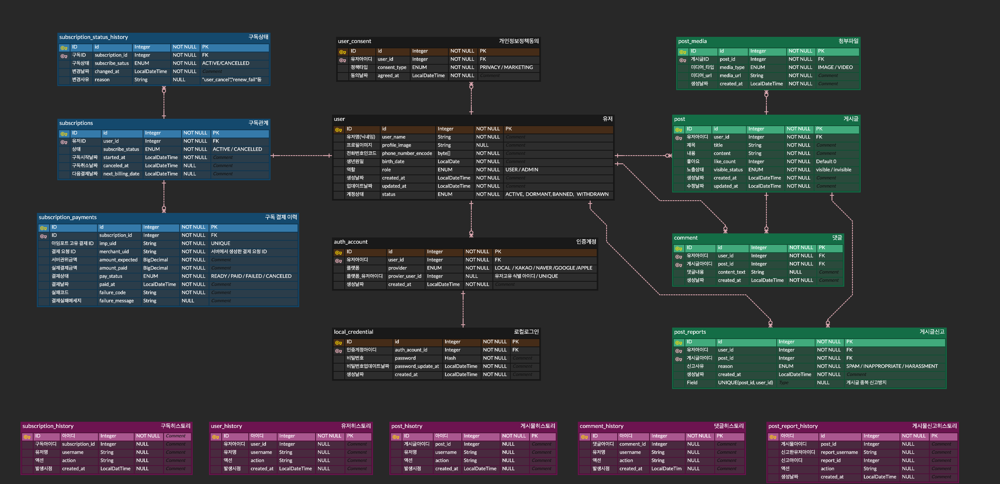
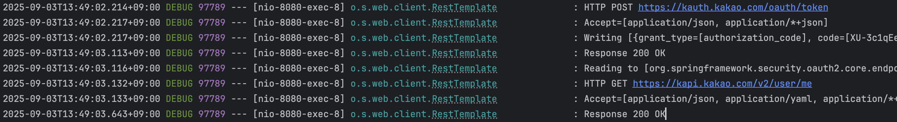

# TNovel 백엔드 프로젝트

### ERD 구조도

---

### Exception 설계

- `ErrorCode` 인터페이스를 기반으로 도메인별 에러 코드(enum)를 일관성 있게 정의
- `BusinessException`을 상위 예외 클래스로 하여, 도메인별 예외(`UserException` 등)를 세분화
- 전역 예외 핸들러 `ExceptionAdvice`에서 `@ExceptionHandler(BusinessException.class)`로 통합 처리
- Validation 관련 예외 (`MethodArgumentNotValidException`, `ConstraintViolationException`) 및 `ResponseStatusException`도 별도
  처리

---

### 인증 방식

- JWT 기반 무상태 인증 방식 사용
- 로그인 성공 시 Access Token이 발급되며, 이후 요청 시 Authorization 헤더를 통해 인증을 수행

### 로그인 방식

- 지원: LOCAL, KAKAO, GOOGLE, APPLE, NAVER
- 카카오 로그인: 구현 완료 (API 호출 성공 및 DB 저장 정상 동작)
- 로컬 회원가입 및 모든 소셜 로그인 시 JWT 토큰 발급 (username + role 기반)
- swagger에서 카카오톡 로그인 api를 시행할 수 없기에 성공 이미지로 대체합니다.
  

---

### 개인정보처리방침 스케쥴러

- 새벽 3시마다 검증, 최후 개인정보처리방침이 1년이 지날 경우 추후 로직(이메일 전송, 페이지 리다이렉팅 등) 할수 있도록 스케쥴러 구현

## 📖작업일지

### 2025-08-30

- 프로젝트 기본 세팅
- Dockerfile 작성 (개발용 + 운영용 yml)

### 2025-08-31

- 전체 요구사항 분석 및 ERD 설계

### 2025-09-02

- 인증 방식 설정 : JWT 토큰
- cors 설정 및 env 추가
- PasswordEncoder : BCryptPasswordEncoder
- PhoneEncryptor : AES (대칭키 암호화, 인증번호 및 마캐팅 목적)

### 2025-09-03

- 먼저 해야할 것 exception 핸들러 로직 먼저 추가 완료
- -로컬 로그인 추가
- Oauth 로그인 추가
- swagger 추가 완료
- 로컬 회원가입 Validation 검증 완료
- 회원가입시 개인정보처리방침 동의 추가, kakao 경우 로그인시 프론트의 추가 redirect 및 별도 POST가 필요하지만, API 호출 불가로 생략(프론트 미구현)
- 스케쥴러 기능 추가
- 어드민 페이지 회원가입, 로그인, 어드민 권한으로 전체 유저 조회 기능 및 Swagger 추가.

### 2025-09-04

- 어드민 관련 API 추가 (모두 페이지네이션 적용)
    + 전체 유저 조회 기능 구현 완료
    + 해당 키워드 포함 아이디를 가진 유저 검색 기능 구현 완료
    + 해당 키워드 포함 닉네임을 가진 유저 검색 기능 구현 완료
    + 해당 날짜에 회원가입한 유저 검색 검색 기능 구현 완료
    + 유저 벤하기 API 추가 완료
    + User 엔티티에 lastLoginAt 추가 후 어드민페이지에서 마지막 로그인 시간도 같이 조회 할수 있게 추가 
